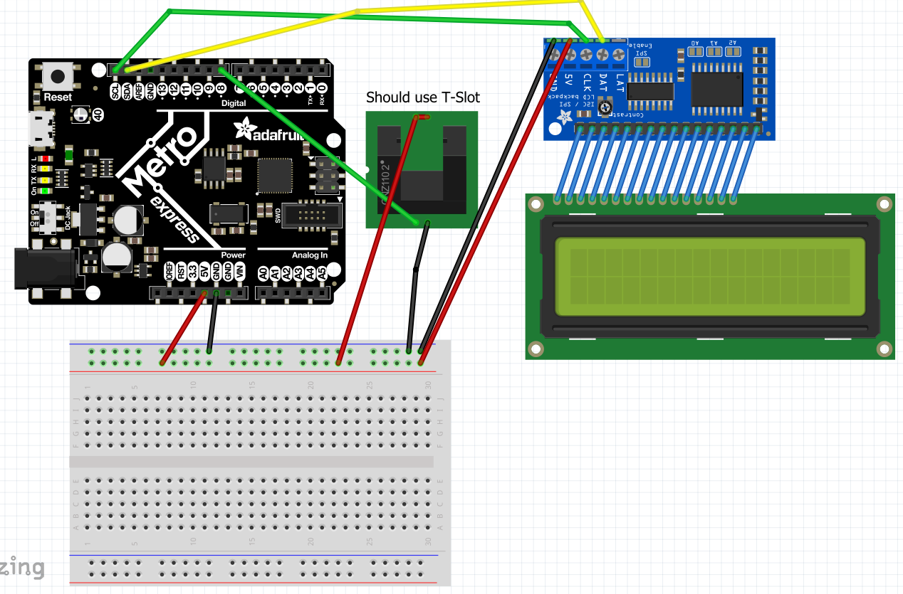

# CircuitPython

My CircuitPython assignments

## Hello CircuitPython (and Metro and Mu)
### Objective
Use the CircuitPython coding language and Metro M0 Express to code a LED to fade in and out
### Wiring

### Lessons & Methods
In this assignment, I learned that the easiest way to code an LED is with a PWM (pulse width moderator) pin.  PWM pins change the percentage of time that the LED is on (duty cycle), which makes it appear as if the brightness is fading in and out.  I also learned the basics of CircuitPython coding language, such as the fact that you have to import modules for most functions, and that while True takes the place of void loop ().

## CircuitPython Servo
### Objective
Using capacitive touch, the 180 micro servo should rotate in one direction when touching one wire, and in the other direction when touching the other### Wiring

### Lessons & Methods
In this assignment, I learned that PWM and duty cycles can also be used for servos, and that using the touchio module, your metro can tell when you are touching a wire.

## CircuitPython LCD
### Objective
The LCD screen should count the number of times a button has been pressed, and the direction of counting should be determined by a switch
### Wiring

### Lessons & Methods
In this assignment, I learned that Metro reads buttons and switches by reading the voltage, so you need to start with them "pulled up" and the Metro will detect when they have been pressed/switched because the voltage will change.  Additionally, I used boolean values (True and False) to prevent the count from going up while the button was pressed down.  If you turn the boolean to True when the button is pressed, and ensure that the count only goes up when the boolean is False, the boolean will have to be unpressed and pressed again for the count to go up.

## CircuitPython Photointerrupters
### Objective
The photo interrupter should count the number of times it has been interrupted, and print this message every 4 seconds, without using time.sleep ()
### Wiring

### Lessons & Methods
In this assigment, I continued using boolean value (True and False) to control the photo interrupt count.  Additionally, I used time.monotonic (), which tracks the time since the program has started, and the MOD function (%) to only print a message when the seconds since the start are divisible by 4.

## CircuitPython Distance Sensor
### Objective
The on-board neopixel RGB LED should change color based on the distance read by an ultrasonic sensor
### Wiring

### Lessons & Methods
In this assignment, I used the neopixel LED, which is built into the Metro, and an HCSR04 ultrasonic sensor.  Additionally, I used try and except functions to prevent a program-stopping error when the distance could not be read.  Finally, I used absolute value and integer functions to find the difference between the distance read and the peak distance for a certain color.  If the distance was within 10 cm of the peak color distance, that color would be a non-0 value.

## Classes, Objects, and Modules
### Objective
Create a new module that allows you to call functions to turn RGB LEDs certain colors
### Wiring

### Lessons & Methods
In this assignment I learned how to create an object (called by "self"), within a class, within a module.  I learned how RGB LEDs have three different pins (red, green, and blue) that can be turned on or off at varying levels of brightness, allowing it to glow a wide variety of colors.

## Hello VS Code
### Objective
Learn to use VS Code by printing a message to the serial monitor
### Lessons & Methods
In this assignment, I learned how to create, edit, and open a VS Code file, and then easily upload it to GitHub.

## FancyLED
### Objective
Use VS Code, and classes, objects and modules to get two sets of LEDs to blink in various patterns.
### Wiring

### Lessons & Methods
In this assignment, I continued to learn about classes, objects and modules, I learned how to run a loop "n" times with the "in range" function, and I discovered the "random" module. I used boolean values (True and False) to turn the LEDs on and off.